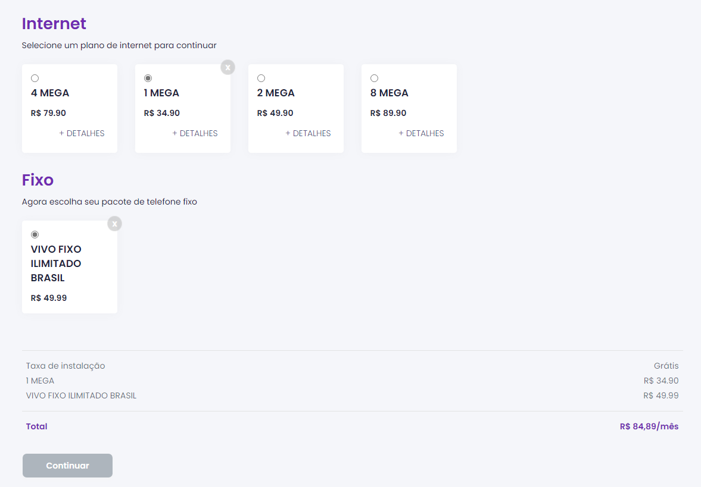

# M2 Teste Frontend

### Versões de dependências utilizadas 
- Nodejs   12.20.1
- Npm      6.14.10
- Yarn     1.22.5
- Vue/cli  4.5.10

### Baixe e execute o projeto localmente

**1 -**  Clone o projeto e instale as dependências:
```
$ git clone https://github.com/wagnerGCastro/m2-teste-frontend
$ cd m2-teste-frontend
$ npm install ou yarn 
```

**2 -**  Rodar servidor Json Server no brownser:
```
- Abra o terminal, dentro da pasta raiz do projeto execute:
$ npm json-server ou yarn json-server

```
Acesse a API: [http://localhost:8091/products](http://localhost:8091/products)

**3 -** Rodar a aplicação no browser
``` 
- Abra o terminal e execute:
$ npm run dev ou yarn dev
```
Acesse o projeto localhost em [https://localhost:8089](https://localhost:8089)


**4 -** Preview do projeto finalizado e hospedado :)

Acesse http://m2-teste-frontend.wagnercastro.tk

